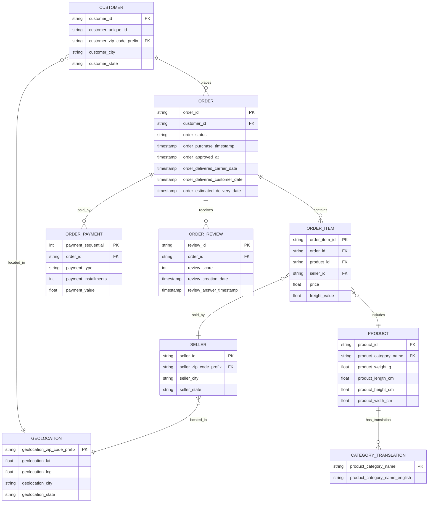
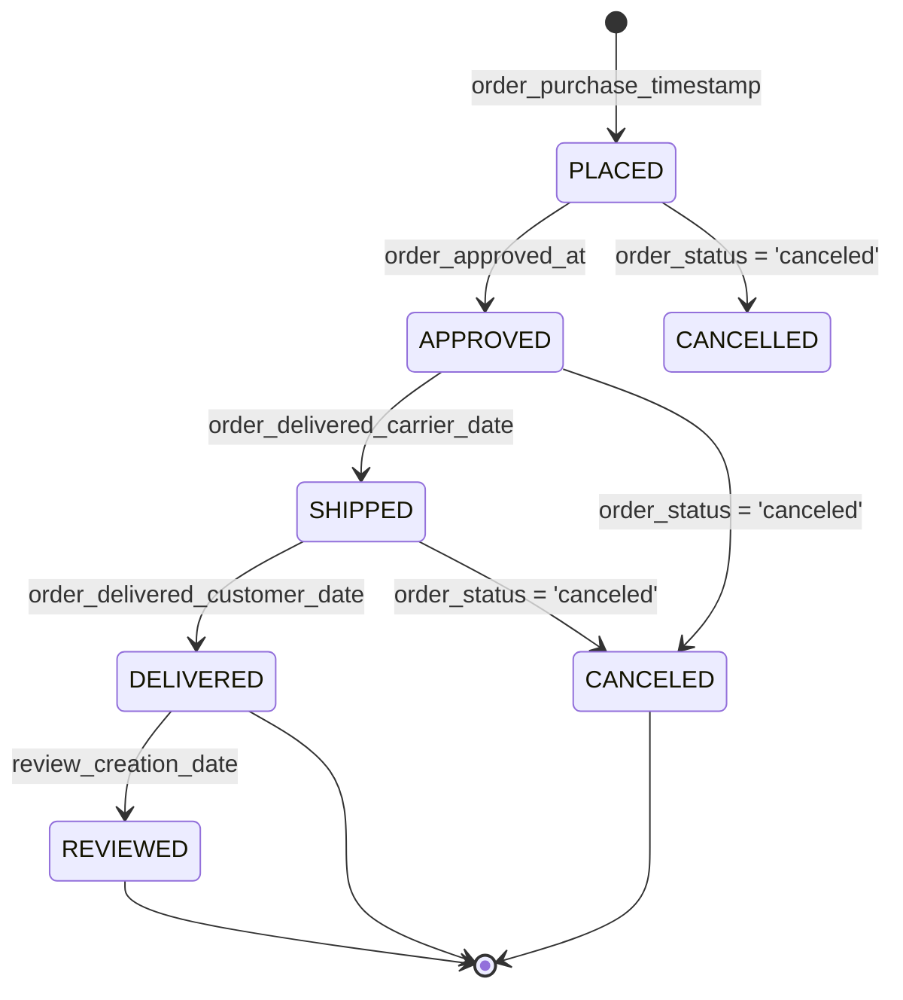
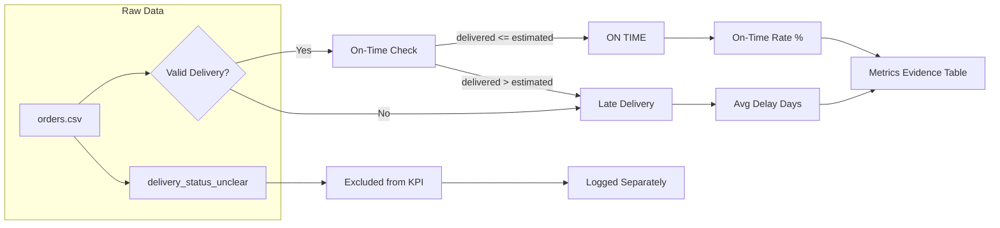
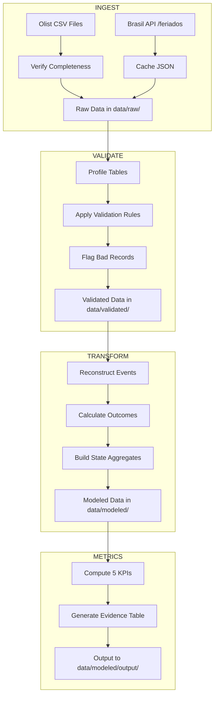

# Workflow Diagram: Olist Delivery Reliability Pipeline

## Entity-Relationship Diagram

---

## Order Event Workflow (State Machine)

---

## Delivery Reliability KPI Flow

---

## Pipeline Stage Diagram

---

## Key Field Lineage for Delivery Reliability

| Event/Field | Source Table | Used For |
|-------------|--------------|----------|
| Order Placed | `orders.order_purchase_timestamp` | Event reconstruction, denominator |
| Order Approved | `orders.order_approved_at` | Pre-ship delay calculation |
| Order Shipped | `orders.order_delivered_carrier_date` | In-transit delay calculation |
| Order Delivered | `orders.order_delivered_customer_date` | On-time check, denominator |
| Estimated Delivery | `orders.order_estimated_delivery_date` | On-time check baseline |
| Customer State | `customers.customer_state` | Geographic segmentation |
| Review Score | `order_reviews.review_score` | Review correlation metric |
| Holiday Proximity | `brasil_holidays.json` | Context flag (not KPI reclassification) |